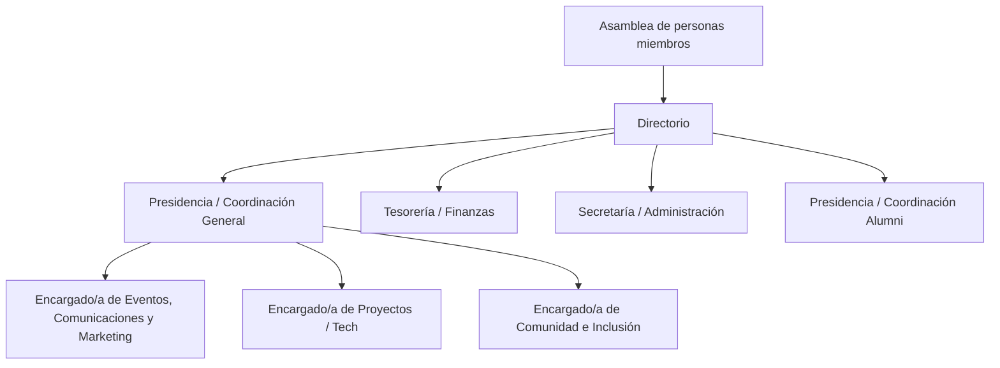

> ⚠️ **Aviso**
>
> Este documento actualmente se encuentra en desarrollo, no es el documento final.
> Cualquier sugerencia se puede hacer a **<comunidad@ousc.dev>**, **<contacto@osuc.dev>** o hablando con algun coordinador.

> ⚠️ **TLDR:**
>
> Este documento describe la estructura organizacional, los cargos formales y los roles operativos necesarios para mantener el funcionamiento de la comunidad, resguardando la distribución de responsabilidades y evitando la concentración de poder en una sola persona.

## Cargos y estructura comunitaria de Open Source eUC

Open Source eUC es una comunidad estudiantil sin fines de lucro, nacida desde la Pontificia Universidad Católica de Chile, orientada a contribuir conocimiento y código al ecosistema de software libre y de código abierto, tanto a nivel nacional como internacional.

Este documento describe la estructura organizacional, los cargos formales y los roles operativos necesarios para mantener el funcionamiento de la comunidad, resguardando la distribución de responsabilidades y evitando la concentración de poder en una sola persona.

---

## Organigrama general

Representación textual:

- Asamblea de personas miembros
- Directorio
  - Presidencia / Coordinación General
  - Tesorería / Finanzas
  - Secretaría / Administración
  - Presidencia / Coordinación Alumni
- Roles operativos
  - Encargado/a de Eventos, Comunicaciones y Marketing
  - Encargado/a de Proyectos / Tech
  - Encargado/a de Comunidad e Inclusión

---

## 1. Principios generales de organización

1. Open Source eUC se organiza en torno a:
    - Una Asamblea de personas miembros, que constituye el espacio de decisión colectiva.
    - Un Directorio, encargado de la coordinación general y la gestión básica de la comunidad.
    - Un conjunto de roles operativos, orientados a llevar a cabo las actividades técnicas, formativas y comunitarias.
2. Todas las funciones descritas en este documento son de carácter voluntario, ejercidas principalmente por estudiantes universitarios.
3. Ninguna persona podrá concentrar de forma exclusiva las decisiones críticas de la comunidad. Las decisiones relevantes deberán contar, al menos, con la participación de dos cargos distintos del Directorio.

---

## 2. Asamblea de personas miembros

La Asamblea de personas miembros está conformada por quienes participan activamente en la comunidad, de acuerdo con los criterios que se definan internamente (asistencia, participación en proyectos, contribuciones, etc.).

A la Asamblea le corresponde:

- Conocer los lineamientos generales de la comunidad.
- Elegir y, cuando corresponda, remover a las personas que integran el Directorio.
- Aprobar las modificaciones a los documentos fundamentales de la comunidad (estatutos, reglamentos internos, código de conducta, entre otros), según los procedimientos que se establezcan.

---

## 3. Directorio

El Directorio es el órgano de coordinación principal de Open Source eUC y está compuesto, al menos, por los siguientes cuatro cargos:

1. Presidencia / Coordinación General
2. Tesorería / Finanzas
3. Secretaría / Administración
4. Presidencia / Coordinación Alumni

Una misma persona podrá ejercer un cargo del Directorio y, simultáneamente, un rol operativo, siempre que ello no impida el cumplimiento adecuado de sus responsabilidades y que exista acuerdo interno para ello.

Las funciones del Directorio incluyen, entre otras:

- Definir, junto con la comunidad, los objetivos y prioridades de cada período.
- Coordinar el calendario general de actividades.
- Velar por el cumplimiento del Código de Conducta y de los principios de la comunidad.
- Asegurar la continuidad mínima de la organización, facilitando procesos de traspaso y rotación de cargos.

---

## 4. Descripción de cargos del Directorio

### 4.1. Presidencia / Coordinación General

#### Propósito del cargo

La Presidencia / Coordinación General tiene por finalidad articular el funcionamiento global de la comunidad, representar a Open Source eUC ante terceros y garantizar que las decisiones y actividades se alineen con la misión y los valores de la comunidad.

#### Responsabilidades principales

- Coordinar las reuniones del Directorio y, cuando corresponda, de la Asamblea.
- Facilitar la definición del plan de trabajo semestral o anual de la comunidad.
- Representar a Open Source eUC ante:
  - La Pontificia Universidad Católica de Chile y otras instituciones de educación superior.
  - Otras comunidades y organizaciones de software libre y de código abierto.
  - Eventuales auspiciadores, organizaciones colaboradoras u otras entidades externas.
- Promover el cumplimiento del Código de Conducta y actuar como punto de escalamiento en situaciones complejas o conflictivas.
- Asegurar la coordinación entre los distintos roles operativos.

#### Limitaciones y contrapesos

- La Presidencia / Coordinación General no puede, por sí sola:
  - Autorizar gastos por sobre el monto que se defina internamente.
  - Imponer sanciones a miembros de la comunidad.
  - Modificar documentos fundamentales sin los procedimientos establecidos.
- Las decisiones críticas deberán contar con la aprobación, al menos, de una persona adicional del Directorio (por ejemplo, Tesorería o Secretaría).

---

### 4.2. Tesorería / Finanzas

#### Propósito del cargo

La Tesorería / Finanzas tiene por finalidad administrar de manera transparente y responsable los recursos económicos de la comunidad, asegurando su correcta rendición y uso en beneficio de las actividades de Open Source eUC.

Este cargo se reporta directamente a la Presidencia / Coordinación Alumni en materias financieras y debe solicitar fondos y rendir gastos a dicha instancia.

#### Responsabilidades principales

- Llevar un registro actualizado de:
  - Ingresos (fondos estudiantiles, aportes institucionales, auspicios, donaciones, venta de merchandising, etc.).
  - Gastos (materiales, logística de eventos, infraestructura tecnológica, dominios, servicios, entre otros).
- Elaborar y presentar, al menos una vez por semestre, un informe financiero sintetizado para la comunidad.
- Proponer presupuestos para eventos, actividades y necesidades operativas.
- Gestionar reembolsos y pagos, de acuerdo con las normas internas y, cuando corresponda, con las de la universidad u organismo que entregue financiamiento externo.
- Custodiar y archivar comprobantes y respaldos de operaciones.
- **Solicitar fondos a Presidencia / Coordinación Alumni** cuando sea necesario realizar gastos operativos.
- **Rendir gastos obligatoriamente** a Presidencia / Coordinación Alumni, presentando boletas, facturas u otros comprobantes válidos dentro del plazo establecido.
- **Mantener actualizada la rendición de gastos**, entregando la documentación respaldatoria dentro de **3 días hábiles** desde la realización del gasto.

#### Modelo de cuentas y tarjetas

- La comunidad opera bajo un **modelo de dos tarjetas bancarias**:
    - **Tarjeta Fuente:** Tarjeta principal vinculada a la cuenta bancaria de la Presidencia Alumni, usada para aprovisionar fondos.
    - **Tarjeta Esclava:** Tarjeta operativa usada por Tesorería / Finanzas para realizar gastos autorizados.
- Este modelo asegura separación de funciones y trazabilidad de los movimientos financieros.

#### Limitaciones y contrapesos

- La Tesorería / Finanzas no podrá ejecutar gastos por sobre el monto límite que se establezca sin la aprobación de, al menos, otra persona del Directorio.
- El acceso efectivo a cuentas, fondos o plataformas de gestión económica deberá ser compartido entre, al menos, dos personas (por ejemplo, Tesorería y Presidencia / Coordinación General), para evitar la concentración de control en una sola persona.

#### Sanciones por incumplimiento de rendición

⚠️ **Sanción por falta de rendición:**

- Si la persona a cargo de Tesorería / Finanzas **utiliza la tarjeta y no rinde la boleta o factura correspondiente dentro de 3 días hábiles**, será **destituida de su cargo de forma inmediata**.
- En ese caso, se convocará a una **votación extraordinaria del Directorio** para designar a una nueva persona en el cargo de Tesorería / Finanzas.
- Esta medida busca garantizar la transparencia, trazabilidad y responsabilidad en el manejo de los recursos comunitarios.

---

### 4.3. Secretaría / Administración

#### Propósito del cargo

La Secretaría / Administración tiene por finalidad resguardar la memoria institucional de la comunidad, organizando la información relevante y garantizando la trazabilidad de acuerdos, procesos y decisiones.

#### Responsabilidades principales

- Redactar y conservar actas de las reuniones del Directorio y, cuando corresponda, de la Asamblea.
- Mantener un registro actualizado de:
  - Personas miembros activas de la comunidad (según los criterios definidos).
  - Equipos y responsables de proyectos.
  - Cargos vigentes y períodos de ejercicio.
- Administrar y actualizar:
  - Reglamentos internos.
  - Código de Conducta.
  - Manuales de funcionamiento y documentos similares.
- Coordinar procesos internos de:
  - Postulación y elección de cargos.
  - Votaciones o consultas a la Asamblea.
  - Facilitar el acceso a la documentación relevante mediante los canales oficiales de la comunidad (repositorios, almacenamiento en la nube, etc.).

#### Limitaciones y contrapesos

- La Secretaría / Administración no define, por sí sola, el contenido de las políticas o acuerdos; su rol es documentar lo que se decide colectivamente y asegurar su accesibilidad.
- Las actas y documentos fundamentales deberán estar disponibles para revisión por parte de las personas miembros, respetando los criterios de transparencia y protección de datos personales que la comunidad adopte.

---

### 4.4. Presidencia / Coordinación Alumni

#### Propósito del cargo

La Presidencia / Coordinación Alumni tiene por finalidad gestionar y articular la comunidad de alumni y ex-estudiantes de Open Source eUC, coordinando su participación activa para que puedan aportar —de cualquier forma— a la comunidad de estudiantes.

#### Responsabilidades principales

- Mantener un registro actualizado de las personas alumni de la comunidad.
- Facilitar canales de comunicación entre alumni y la comunidad activa de estudiantes.
- Coordinar iniciativas que permitan a los alumni contribuir a la comunidad, tales como:
  - Mentoría y orientación profesional.
  - Charlas, talleres o sesiones de experiencia laboral.
  - Apoyo técnico en proyectos.
  - Conexiones con la industria y oportunidades laborales.
- Organizar encuentros y actividades que fortalezcan el vínculo entre alumni y estudiantes.
- Identificar y canalizar oportunidades de colaboración entre la comunidad alumni y Open Source eUC.
- Reportar periódicamente al Directorio sobre el estado y actividades de la comunidad alumni.
- **Gestión administrativa y financiera:**
    - Ser titular de la cuenta bancaria principal de la comunidad.
    - Supervisar las solicitudes de fondos realizadas por Tesorería / Finanzas.
    - Aprobar las rendiciones de gastos presentadas por Tesorería / Finanzas.

#### Requisitos para el cargo

- Haber cumplido, al menos, **1 año como Alumni activo** en la comunidad.
- Esta condición asegura conocimiento profundo de la comunidad y continuidad en la gestión administrativa y legal.

#### Membresía de la comunidad Alumni

- Los **miembros activos Alumni de este año** serán designados por la Coordinación General en conjunto con la Presidencia Alumni.
- Se establecerá una **definición explícita de membresía activa** a inicios de 2027, en coordinación con el Directorio.

#### Limitaciones y contrapesos

- La Presidencia / Coordinación Alumni no puede, por sí sola:
  - Establecer compromisos formales con entidades externas en nombre de Open Source eUC sin la aprobación del Directorio.
  - Autorizar el uso de recursos de la comunidad para actividades alumni sin coordinación con Tesorería / Finanzas.
    - Realizar gastos directos sin la rendición correspondiente por parte de Tesorería / Finanzas.
- Las decisiones que afecten significativamente a la comunidad de estudiantes deberán ser coordinadas con la Presidencia / Coordinación General y el Directorio.

---

## 5. Roles operativos

Además del Directorio, Open Source eUC se apoya en tres roles operativos clave, orientados a la ejecución de las actividades de la comunidad. Estos roles podrán ser ejercidos por una o más personas, según la disponibilidad de voluntariado y las necesidades del período.

Los roles operativos son:

1. Encargado/a de Eventos, Comunicaciones y Marketing
2. Encargado/a de Proyectos / Tech
3. Encargado/a de Comunidad e Inclusión

---

## 6. Descripción de roles operativos

### 6.1. Encargado/a de Eventos, Comunicaciones y Marketing

#### Propósito del rol

Planificar, coordinar y difundir las actividades de Open Source eUC, fortaleciendo su presencia tanto en espacios presenciales como digitales.

#### Responsabilidades principales

- Diseñar, en coordinación con el Directorio, el calendario de eventos de la comunidad (talleres, charlas, hackathons, encuentros sociales u otros).
- Coordinar la logística básica de las actividades:
  - Reserva de salas y espacios físicos.
  - Coordinación de horarios, enlaces de reunión en línea y requerimientos técnicos mínimos.
- Gestionar las comunicaciones externas e internas:
  - Publicación de actividades en redes sociales y demás canales oficiales.
  - Difusión de convocatorias, novedades y logros de la comunidad.
- Contribuir al mantenimiento de una identidad visual coherente:
  - Uso del logotipo y paleta de colores definidos.
  - Uso de plantillas para presentaciones, afiches y publicaciones.
- Recopilar y sistematizar retroalimentación de las actividades para mejorar su diseño y ejecución futura.

#### Limitaciones y contrapesos

- No puede emitir, por sí sola, comunicados que alteren políticas, posiciones oficiales o documentos fundamentales de la comunidad sin la validación del Directorio.
- En temas sensibles (por ejemplo, conflictos internos, comunicaciones asociadas a la aplicación del Código de Conducta u otros asuntos delicados), deberá coordinarse de forma especial con el Directorio y con el Encargado/a de Comunidad e Inclusión.

---

### 6.2. Encargado/a de Proyectos / Tech

#### Propósito del rol

Facilitar el desarrollo, mantenimiento y sostenibilidad de los proyectos técnicos y repositorios de la comunidad, promoviendo buenas prácticas de contribución en software libre y de código abierto.

#### Responsabilidades principales

- Administrar la organización en la plataforma de control de versiones utilizada por la comunidad (por ejemplo, GitHub), en coordinación con el Directorio.
- Definir y mantener:
  - Guías de contribución (CONTRIBUTING, templates de issues y pull requests, etc.).
  - Estándares mínimos de calidad, revisión de código y etiquetado de tareas.
- Apoyar la creación y el lanzamiento de nuevos proyectos comunitarios:
  - Configuración inicial de repositorios.
  - Definición de tareas iniciales y etiquetado de “buenas primeras contribuciones”.
- Promover instancias técnicas:
  - Sesiones de codificación conjunta.
  - Jornadas de revisión de issues.
  - Actividades de onboarding técnico para personas nuevas.
- Velar por el alineamiento de los proyectos con los principios de la comunidad y con las políticas de licenciamiento que esta defina.

#### Limitaciones y contrapesos

- La administración técnica de la organización no deberá estar concentrada en una sola persona. Al menos una persona adicional (por ejemplo, de Presidencia / Coordinación General) deberá contar con permisos suficientes para garantizar la continuidad de los proyectos.
- No se podrán eliminar, archivar ni modificar licencias de proyectos comunitarios sin conocimiento y acuerdo del Directorio, de acuerdo con los mecanismos definidos.

---

### 6.3. Encargado/a de Comunidad e Inclusión

#### Propósito del rol

Cuidar el clima humano de la comunidad, fomentando la participación segura, respetuosa e inclusiva, y apoyando la aplicación del Código de Conducta.

#### Responsabilidades principales

- Actuar como punto de contacto inicial para:
  - Consultas o preocupaciones relacionadas con el ambiente de la comunidad.
  - Situaciones que puedan constituir incumplimientos del Código de Conducta.
  - Facilitar procesos de diálogo y mediación cuando se presenten conflictos entre personas miembros, buscando soluciones respetuosas y acordes a los principios de la comunidad.
  - Colaborar con el Directorio en la aplicación de medidas cuando se identifiquen vulneraciones al Código de Conducta, siguiendo los procedimientos definidos.
- Proponer y apoyar actividades que:
  - Promuevan la inclusión de personas de diversos contextos y niveles de experiencia.
  - Faciliten la integración de personas nuevas a la comunidad.
  - Contribuyan al bienestar general de quienes participan en Open Source eUC.
- Trabajar coordinadamente con el rol de Eventos, Comunicaciones y Marketing para asegurar que los mensajes, imágenes y dinámicas asociadas a la comunidad sean coherentes con los principios de inclusión y respeto.

#### Limitaciones y contrapesos

- El Encargado/a de Comunidad e Inclusión no impondrá sanciones de forma unilateral. En caso de ser necesario adoptar medidas formales, estas deberán ser acordadas con el Directorio y seguir los procedimientos establecidos en el Código de Conducta u otros documentos pertinentes.
- La información sensible compartida en el contexto de este rol deberá tratarse con confidencialidad y cuidado, respetando la privacidad de las personas involucradas, dentro de los márgenes permitidos por los procedimientos comunitarios.

---

## 7. Disposiciones finales

1. Los cargos y roles descritos en este documento podrán ser revisados y ajustados por la Asamblea de personas miembros, de acuerdo con las necesidades y crecimiento de la comunidad.
2. En caso de vacancia de un cargo o rol, el Directorio podrá designar temporalmente a una persona para asumirlo, hasta que se realice el proceso de reemplazo que se defina internamente.
3. Este documento se interpreta de forma complementaria al Código de Conducta y a los demás reglamentos y manuales de Open Source eUC. En caso de contradicción, prevalecerán los principios fundantes de la comunidad y las decisiones de la Asamblea, según los procedimientos establecidos.
